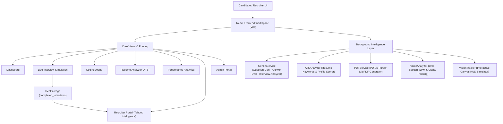

# 🎯 InterviewIQ AI – Multi-Modal AI Interview Assessment Platform

InterviewIQ AI is a state-of-the-art, multi-modal AI interview simulator and career readiness workspace. It evaluates candidates across multiple dimensions in real-time, including technical knowledge, coding skills, vocal delivery, facial expressions, eye contact, and ATS resume compatibility.

Built using React 19, Vite, and Tailwind CSS, the platform harnesses Google Gemini 1.5 Flash (with a fully featured offline fallback engine) to provide **adaptive, non-repeating questioning**, **objective grading**, **AI-powered record analysis**, and **professional PDF report generation** upon completion.

---

## 🛠️ Key Platform Features

- **🎙️ Real-Time Voice Intelligence**: Integrates Web Speech API for multi-lingual speech-to-text conversion (supporting English, Hindi, Tamil, Telugu, Kannada, and Bengali) and text-to-speech question reading. Analyzes speech patterns for Words Per Minute (WPM), voice stability, and filler word count in real-time.
- **👁️ Face Mesh & Eye Tracking HUD**: Uses an HTML5 Canvas HUD overlay tracking facial coordinates, emotion matrices (Neutral, Happy, Nervous, Surprised, etc.), attention levels, posture stability, and eye contact consistency.
- **🤖 Adaptive AI Questioning Engine**: Dynamically generates unique, non-repeating interview questions for every session using Google Gemini 1.5 Flash. Passes previously asked questions to the AI to prevent duplicates. Falls back to a randomized 160+ question database covering 8 roles × 4 interview types when offline.
- **🧠 AI Interview Record Analyzer**: Recruiters can synthesize a candidate's full interview record (spoken answers, facial metrics, scores) through a single button click. The AI produces a detailed report covering Role Fit, Technical Depth, Communication Assessment, and a Hiring Recommendation (Strong Hire / Hire / Under Review / Reject).
- **💻 Coding Arena**: Fully featured editor with problem sets. Includes real-time static code analysis and Gemini-powered optimization feedback (time/space complexity estimates, code style reviews, and structural suggestions).
- **📄 Resume ATS Analyzer**: Parses PDF resumes locally using `PDF.js` and evaluates formatting, contact details, word count, and matches/missing industry keywords for 8+ primary tech profiles (Software Engineer, AI/ML, UI/UX, PM, etc.).
- **📊 Interactive Analytics Dashboard**: Generates comprehensive visual scorecards, performance trends, communication metrics, and core skill matrices powered by `recharts`.
- **💼 Recruiter Portal with Tabbed Intelligence**: Dedicated candidate workspace with three inspection tabs — **Overview** (score matrix + metadata), **AI Insights** (live AI synthesis with hiring recommendation), and **Q&A Transcript** (full question-answer timeline with per-question strength/weakness critiques and ideal answer tips).
- **🗂️ Admin Portal**: Advanced prompt editor, diagnostic logs, API usage telemetry, and key status management.

---

## 🤖 AI System Details

### Dynamic Question Generation

Each session generates a **completely fresh, randomized set of questions** with no repeats:

1. If a Gemini API key is configured, the AI is prompted with the role, difficulty, interview type, prior answers, and a list of already-asked questions — ensuring every question is contextually unique.
2. When offline, a curated **160+ question database** (8 roles × 4 interview types × 4-6 questions each) is used with random selection, filtering out any already-asked questions in that session.

**Covered Roles:** Software Engineer, Data Scientist, Full Stack Developer, AI/ML Engineer, Android Developer, Cybersecurity Analyst, UI/UX Designer, Product Manager

**Covered Interview Types:** Technical, Behavioral, HR Interview, System Design

### AI Interview Record Analysis

The `GeminiService.analyzeInterview(candidate)` method synthesizes a candidate's complete interview record into a structured report:

```json
{
  "fitSummary": "Narrative evaluation of candidate fit and traits.",
  "technicalAnalysis": "Technical correctness review and identified knowledge gaps.",
  "communicationAnalysis": "Verbal delivery, pacing, eye contact, and confidence assessment.",
  "hiringRecommendation": "Strong Hire / Hire / Under Review / Reject",
  "recommendationReason": "Data-driven rationale for the hiring decision."
}
```

A smart heuristic offline fallback generates this report based on score thresholds when no API key is present, ensuring the full recruiter experience works offline.

---

## 🏗️ Architecture & Data Flow



---

## 💻 Tech Stack & Dependencies

| Category | Technology / Library | Description |
| :--- | :--- | :--- |
| **Core Framework** | [React 19](https://react.dev/) & [Vite](https://vite.dev/) | Ultra-fast client-side hot-reloading and modular rendering. |
| **Styling Engine** | [Tailwind CSS v3](https://tailwindcss.com/) & PostCSS | Utility-first UI styling with custom brand palettes and fonts. |
| **AI Integration** | [Google Gemini 1.5 Flash](https://ai.google.dev/) | Adaptive question generation, answer evaluation, and interview record synthesis. |
| **Visualization** | [Recharts](https://recharts.org/) | Renders interactive skill matrices, bar charts, and area trend lines. |
| **PDF Processing** | [PDF.js](https://mozilla.github.io/pdf.js/) & [jsPDF](https://github.com/parallax/jsPDF) | Parses text from uploaded resumes and exports graded scorecard reports. |
| **Icons & Effects** | [Lucide React](https://lucide.dev/) & Canvas-Confetti | Responsive vector iconography and candidate celebration triggers. |

---

## 🚀 Getting Started

### Prerequisites

Ensure you have [Node.js](https://nodejs.org/) installed (v18+ recommended) along with `npm`.

### Installation Steps

1. **Clone the Repository**:
   ```bash
   git clone https://github.com/Manishsah098/AI-Interview-Simulator.git
   cd "AI-Interview-Simulator"
   ```

2. **Install Dependencies**:
   ```bash
   npm install
   ```

3. **Configure API Key (Optional)**:
   - The application works fully offline with a smart fallback engine — no API key required.
   - For real-time Gemini intelligence (adaptive questions + AI analysis), open the **Admin Portal** tab in the app and securely enter your [Google Gemini API Key](https://aistudio.google.com/app/apikey). It is saved in your browser's `localStorage`.

4. **Launch the Development Server**:
   ```bash
   npm run dev
   ```
   *The server starts at `http://localhost:3000` (configured in `vite.config.js`).*

5. **Build for Production**:
   ```bash
   npm run build
   ```
   *Compiles optimized static assets into the `dist/` directory.*

---

## 📂 Project Structure & Module Directory

```text
├── index.html                  # Main application entry point & font loading
├── tailwind.config.js          # Extended color palettes and typography
├── vite.config.js              # Vite configuration — port set to 3000
├── src/
│   ├── main.jsx                # Render mount point for React 19
│   ├── App.jsx                 # App router, Navbar, and layout configuration
│   ├── index.css               # Base Tailwind imports & glassmorphism utilities
│   │
│   ├── components/             # Reusable UI Components
│   │   ├── AudioAnalyzer.jsx   # Real-time microphone capture, waveform & WPM meter
│   │   ├── FaceTracker.jsx     # Webcam HUD overlay & emotion matrix renderer
│   │   ├── CodeEditor.jsx      # Language-selective code editor with problem presets
│   │   └── Navbar.jsx          # Top navigation bar with language switch selectors
│   │
│   ├── pages/                  # Full-Page Routing Views
│   │   ├── Dashboard.jsx       # Landing screen with platform onboarding & quick shortcuts
│   │   ├── LiveInterview.jsx   # Voice-controlled AI mock simulator with non-repeating questions
│   │   ├── ResumeAnalyzer.jsx  # Drag-and-drop resume upload and ATS diagnostic scoring
│   │   ├── CodingArena.jsx     # Coding editor page with Gemini feedback parameters
│   │   ├── Analytics.jsx       # Aggregated radar and area chart performance summaries
│   │   ├── RecruiterPortal.jsx # Tabbed candidate intelligence dashboard (Overview · AI Insights · Q&A Transcript)
│   │   └── AdminPortal.jsx     # Prompt editor, diagnostic logs, and API key management
│   │
│   └── services/               # Core Analytical APIs
│       ├── geminiService.js    # Gemini 1.5 Flash wrapper: question gen, eval & interview analyzer
│       ├── atsService.js       # Profile keyword checklists and ATS scoring mechanics
│       ├── pdfService.js       # PDF text parsing & styled PDF scorecard exporter
│       ├── speechService.js    # Speech recognition and natural voice synthesis (TTS)
│       └── visionService.js    # Simulated webcam visual tracker and Canvas rendering
```

---

## ⚙️ Service Integrations Deep-Dive

### 1. Gemini AI & Fallback Service (`src/services/geminiService.js`)

- **Question Generation** (`generateQuestion`): Sends role, difficulty, type, prior answers, and already-asked questions to `gemini-1.5-flash`. Offline fallback randomly selects from a 160+ question bank, filtering out duplicates within the session.
- **Answer Evaluation** (`evaluateAnswer`): Scores candidate responses on technical depth, communication clarity, identifies strengths and weaknesses, and provides an ideal answer tip.
- **Interview Record Synthesis** (`analyzeInterview`): Accepts a full candidate record and returns a structured hiring analysis report. Includes a rich heuristic fallback when offline.
- **API endpoint**: `https://generativelanguage.googleapis.com/v1beta/models/gemini-1.5-flash:generateContent?key={API_KEY}`

### 2. Speech Analytics (`src/services/speechService.js`)

- **SpeechRecognition API**: Captures voice feed, transcribes responses in real-time, tracks filler words (*um*, *like*, *basically*, *literally*, *you know*), and measures speaking pace (WPM).
- **SpeechSynthesis API**: Speaks questions out loud using natural voice parameters matched to the selected interview language.

### 3. Face Mesh HUD (`src/services/visionService.js`)

- Draws dynamic Canvas oval constraints, corner target brackets, eye landmark indicators, and smile-detecting curves representing computer vision metrics.
- Computes emotion vectors, tracks visual changes in response attention, head angles, and nervousness indexes.

### 4. ATS Assessment Engine (`src/services/atsService.js`)

- Inspects resume text against role-specific keyword lists. Supports Software Engineers, Product Managers, UI/UX Designers, Cybersecurity Analysts, and AI/ML Specialists.
- Grades resumes on formatting markers, contact completeness, GitHub/LinkedIn presence, and provides actionable improvement recommendations.

### 5. Recruiter Portal Intelligence (`src/pages/RecruiterPortal.jsx`)

- **Overview Tab**: Score matrix (Overall, ATS, Coding, Eye Contact) with session metadata.
- **AI Insights Tab**: Triggers `GeminiService.analyzeInterview()` with animated loading state. Displays role fit summary, technical depth review, communication analysis, and a color-coded hiring recommendation badge.
- **Q&A Transcript Tab**: Renders a full vertical timeline of every question asked, the candidate's verbatim spoken answer, and individual AI critiques (score %, strengths, weaknesses, ideal answer tip).

---

## 🔄 Changelog

### v1.2.0 — AI Record Analysis & Dynamic Questioning
- ✅ **Non-repeating questions**: Sessions now pass already-asked questions to the AI and offline fallback to guarantee variety.
- ✅ **Randomized offline selection**: Offline fallback now picks questions randomly (not sequentially) from the filtered available pool.
- ✅ **160+ question database**: Expanded from 5 roles to 8 roles, each with 4 interview types and 4-6 premium questions.
- ✅ **Role-matching engine**: Added `getBaseRole()` to correctly map enhanced role strings (e.g., `"Software Engineer at google.com"`) to the question database.
- ✅ **Full transcript persistence**: Completed interviews now save the full `answers` and `evaluations` arrays to `localStorage` for recruiter review.
- ✅ **AI Interview Record Analyzer**: New `GeminiService.analyzeInterview()` method synthesizes candidate records into structured hiring reports.
- ✅ **Recruiter Portal — Tabbed Interface**: Replaced single-panel with three-tab layout: Overview, AI Insights, Q&A Transcript.
- ✅ **Bug fix**: Spinner no longer gets stuck when switching candidates mid-analysis.
- ✅ **Bug fix**: AI analysis state updates are now identity-checked — analysis from candidate A will never overwrite candidate B's profile.

### v1.1.0 — Initial Platform Release
- Live interview simulation with voice, face tracking, and Gemini question generation.
- Resume ATS analyzer, Coding Arena, Analytics dashboard, Recruiter & Admin portals.

---

## 📝 License

This project is open-source and available under the **MIT License**.
