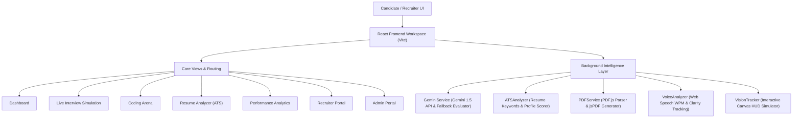

# 🎯 InterviewIQ AI – Multi-Modal AI Interview Assessment Platform

InterviewIQ AI is a state-of-the-art, multi-modal AI interview simulator and career readiness workspace. It evaluates candidates across multiple dimensions in real-time, including technical knowledge, coding skills, vocal delivery, facial expressions, eye contact, and ATS resume compatibility.

Built using React 19, Vite, and Tailwind CSS, the platform harnesses Google Gemini 1.5 Flash (with a fully featured offline fallback engine) to provide adaptive questioning and objective grading, generating professional PDF reports upon completion.

---

## 🛠️ Key Platform Features

- **🎙️ Real-Time Voice Intelligence**: Integrates Web Speech API for multi-lingual speech-to-text conversion (supporting English, Hindi, Tamil, Telugu, Kannada, and Bengali) and text-to-speech reading. Analyzes speech patterns for Words Per Minute (WPM), voice stability, and tracks filler word count in real-time.
- **👁️ Face Mesh & Eye Tracking HUD**: Uses a HTML5 Canvas HUD overlay tracking facial coordinates, emotion matrices (Neutral, Happy, Nervous, Surprised, etc.), attention levels, posture stability, and eye contact consistency.
- **💻 Coding Arena**: Fully featured editor with problem sets. Includes real-time static code analysis and Gemini-powered optimization feedback (time/space complexity estimates, code style reviews, and structural suggestions).
- **📄 Resume ATS Analyzer**: Parses PDF resumes locally using `PDF.js` and evaluates formatting, contact details, word count, and matches/missing industry keywords for 8+ primary tech profiles (Software Engineer, AI/ML, UI/UX, PM, etc.).
- **📊 Interactive Analytics Dashboard**: Generates comprehensive visual scorecards, performance trends, communication metrics, and core skill matrices powered by `recharts`.
- **💼 Recruiter & Admin Portals**: Dedicated workspaces enabling job description criteria setting, prompt tuning, API usage telemetry, candidate gradebooks, and system log diagnostics.

---

## 🏗️ Architecture & Data Flow

The flow diagram below displays the interaction between the React user interface components, background analysis services, and external APIs/offline fallback mechanisms:



---

## 💻 Tech Stack & Dependencies

| Category | Technology / Library | Description |
| :--- | :--- | :--- |
| **Core Framework** | [React 19](https://react.dev/) & [Vite](https://vite.dev/) | Ultra-fast client-side hot-reloading and modular rendering. |
| **Styling Engine** | [Tailwind CSS v3](https://tailwindcss.com/) & PostCSS | Utility-first UI styling with custom brand palettes and fonts. |
| **AI Integration** | [Google Gemini 1.5 Flash](https://ai.google.dev/) | Cognitive prompt-based question generation and assessment. |
| **Visualization** | [Recharts](https://recharts.org/) | Renders interactive skill matrices, radar charts, and trend lines. |
| **PDF Processing** | [PDF.js](https://mozilla.github.io/pdf.js/) & [jsPDF](https://github.com/parallax/jsPDF) | Parses text from uploaded resumes and exports graded scorecard reports. |
| **Icons & Effects**| [Lucide React](https://lucide.dev/) & Canvas-Confetti | Responsive vector iconography and candidate celebration triggers. |

---

## 🚀 Getting Started

### Prerequisites

Ensure you have [Node.js](https://nodejs.org/) installed (v18+ recommended) along with `npm` or `yarn`.

### Installation Steps

1. **Clone the Repository**:
   ```bash
   git clone <repository-url>
   cd "Interview Simulator"
   ```

2. **Install Dependencies**:
   ```bash
   npm install
   ```

3. **Configure API Keys (Optional)**:
   - You can run the application immediately offline; it is equipped with a smart fallback generator.
   - For real-time Gemini intelligence, open the **Admin Portal** or **Live Interview** tab directly in the app, and securely input your Google Gemini API key. It is saved locally in your browser's secure `localStorage`.

4. **Launch the Development Server**:
   ```bash
   npm run dev
   ```
   *The server will start locally, typically at `http://localhost:3000` (or as configured in `vite.config.js`).*

5. **Build for Production**:
   ```bash
   npm run build
   ```
   *This compiles optimized static assets into the `dist/` directory.*

---

## 📂 Project Structure & Module Directory

```text
├── index.html                  # Main application entry point & font loading
├── tailwind.config.js          # Extended color palettes and typography
├── vite.config.js              # Vite configuration setting port to 3000
├── src/
│   ├── main.jsx                # Render mount point for React 19
│   ├── App.jsx                 # App router, Navbar, and layout configuration
│   ├── index.css               # Base Tailwind imports & custom scrollbar styles
│   │
│   ├── components/             # Reusable UI Components
│   │   ├── AudioAnalyzer.jsx   # Real-time microphone capture, waveform and WPM meter
│   │   ├── FaceTracker.jsx     # Webcam component rendering the HUD overlay & emotion matrix
│   │   ├── CodeEditor.jsx      # Language-selective source code editor with problem presets
│   │   └── Navbar.jsx          # Top navigation bar containing language switch selectors
│   │
│   ├── pages/                  # Full-Page Routing Views
│   │   ├── Dashboard.jsx       # Landing screen with platform onboarding and quick shortcuts
│   │   ├── LiveInterview.jsx   # Voice-controlled AI interview mock simulator
│   │   ├── ResumeAnalyzer.jsx  # Drag-and-drop resume upload and ATS diagnostic scoring
│   │   ├── CodingArena.jsx     # Coding editor page with feedback parameters
│   │   ├── Analytics.jsx       # Aggregated radar and area chart data summaries
│   │   ├── RecruiterPortal.jsx # Candidate scoring dashboard, scorecard exports, and benchmarks
│   │   └── AdminPortal.jsx     # Advanced prompt editor, diagnostic logs, and API status keys
│   │
│   └── services/               # Core Analytical APIs
│       ├── geminiService.js    # Interface wrapper for Gemini 1.5 Flash with offline fallback
│       ├── atsService.js       # Profile keyword checklists and ATS scoring mechanics
│       ├── pdfService.js       # PDF text parsing & styled PDF scorecard exporter
│       ├── speechService.js    # Speech recognition and natural voice synthesis (TTS)
│       └── visionService.js    # Simulated web camera visual tracker and Canvas rendering
```

---

## ⚙️ Service Integrations Deep-Dive

### 1. Gemini AI & Fallback Service (`src/services/geminiService.js`)
- Uses direct POST requests to the `v1beta` Google API: `https://generativelanguage.googleapis.com/v1beta/models/gemini-1.5-flash:generateContent?key={API_KEY}`.
- Smart fallbacks generate domain-specific questions (e.g., Software Engineering concepts, AI/ML pipelines, Data Science regularization, HR behavior) offline when no API key is specified.

### 2. Speech Analytics (`src/services/speechService.js`)
- **SpeechRecognition API**: Captures voice feed, transcribes responses in real-time, and checks content for filler words (e.g., *um*, *like*, *basically*, *literally*, *you know*).
- **SpeechSynthesis API**: Speaks questions out loud using natural voice parameters.

### 3. Face Mesh HUD (`src/services/visionService.js`)
- Draws dynamic Canvas oval constraints, corner target brackets, eye landmark indicators, and smile-detecting curves representing computer vision metrics.
- Computes emotion vectors, tracking visual changes in response attention, head angles, and nervousness indexes.

### 4. ATS Assessment Engine (`src/services/atsService.js`)
- Inspects text against role-specific lists. Supports Software Engineers, Product Managers, UI/UX Designers, Cyber Analyst, and AI/ML Specialists.
- Grades candidate resumes on formatting markers, contact options, github/linkedin anchors, and provides actionable recommendations.

---

## 📝 License

This project is open-source and available under the **MIT License**.
